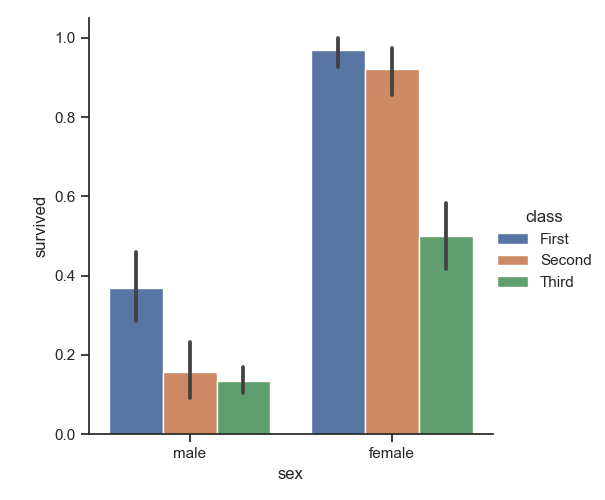

# Contents
[1-Headings](#1--Headings)\
[2-Block of worlds](#2-block-of-words)\
[3-Line breaks](#3-line-breaks)\
[4-Combine two things](#4-combine-two-things)\
[5-Text Face](#5-face-of-text)\
[6-Bullets](#6-bullet-points-lists)\
[7-Line or page break](#7-line-break-or-page-break)\
[8-Links](#8-links-and-hyperlinks)\
[9-Figures](#9-images-and-figures-with-links)\
[10-Code or Code block](#10--adding-code-or-code-block)\
[11-Tables](#11-adding-tables)\
[12-Commenting out lines](#12--for-commenting-out-lines-in-markdown)\
[installing extensions](#13-install-extensions)

# 1-Headings in markdown
How to give headings in markdown files?
# Heading 1
## Heading 2
### Heading 3
#### Heading 4
##### Heading 5
###### Heading 6

# 2-Block of words
This is a normal text in Markdown
> This is a block of special text

> This is a second line

# 3-Line breaks
This is a 40 days long course of Data science with aamar AkA Python_ka_chilla

This is a second line.

This is a 40 days long course of Data science with aamar AkA Python_ka_chilla.\
This is a second line.

# 4-Combine two things
Block of worlds and heading

> ## Heading 2

# 5-Face of text
Bold
**khizar**
Italic
*khizar*
Bold and italic
***khizar***

Or you can use these symbols
_(underscore)
_khizar_
__khizar__

# 6-Bullet points/ Lists
- Day-1
- Day-2
- Day-3
- Day-4
- Day-5
    - Day 5a #use tab
    - Day 5b
        - Day 5b1

> using * or +
* day1
*__day__

+ day2

>Numbering of list
1. Day1
2. Day2
3. Day3
    1. Day3a
    2. Day3b

# 7-Line break or Page break

This is page 1.
_ _ _ 
***
----
This is page 2.

# 8-Links and Hyperlinks

<https://www.youtube.com/watch?v=QvPekMN4F0w&list=PL9XvIvvVL50HVsu-Ao8NBr0UJSO8O6lBI>

[The plyalist is here](https://www.youtube.com/watch?v=QvPekMN4F0w&list=PL9XvIvvVL50HVsu-Ao8NBr0UJSO8O6lBI)

[codonic youtube channel]:https://www.youtube.com/watch?v=QvPekMN4F0w&list=PL9XvIvvVL50HVsu-Ao8NBr0UJSO8O6lBI

The whole coarse is [here][codonic youtube channel]

# 9-Images and Figures with links

Please see picture here: 


Online picture link:[codanics](https://www.google.com/search?q=codanics&source=lnms&tbm=isch&sa=X&ved=2ahUKEwjAyNOV2Kb1AhWE2-AKHR89BEMQ_AUoAnoECAEQBA&biw=639&bih=510&dpr=1.5#imgrc=GRjVtCcWAILqOM)

# 10- Adding code or code block

To print a string use `print("codanics")`

`print("Hello khizar")`

```
x=5+6
y=3-2
z=x+y
print(z)
```

```python
x=5+6
y=3-2
z=x+y
print(z)
```
>This code will show color according to R language syntax

```R
x=5+6
y=3-2
z=x+y
print(z)
```
# 11-Adding tables

| Species |petal_lenght| sepal_length|
| :--------:| -----------:| :----------- |
| virginca | 18.2| 19.2|
|setosa| 15.1| 17.3|
versicolor| 12.2| 12.2|

# 12- For commenting out lines in markdown

Right text in brackets

- []: # (This is a comment)
- []: # "And this is a comment"
- []: # 'Also this is a comment'
- [//]: #(Yet another comment)
- [comment]: # (Still another comment)
For example 

[my name is ]: #
[/my name is/]: #
shortcut key is ctrl+k ctrl c 
ctrl+k ctrl u 

# 13-Install extensions

**sample text**

**bold**

_italic_

**_italic and bold_**

[link](https://www.youtube.com/watch?v=qJqAXjz-Rh4&list=PL9XvIvvVL50HVsu-Ao8NBr0UJSO8O6lBI&index=21)


[image](Figure_1.png)

~~image~~

```
image
```
`image`

>1. 

Column A | Column B | Column C
---------|----------|---------
 A1 | B1 | C1
 A2 | B2 | C2
 A3 | B3 | C3

Column A | Column B | Column C
---------|----------|---------
 A1 | B1 | C1
 A2 | B2 | C2
 A3 | B3 | C3

# 14- Adding colors

Normal text

<span style="color:red">
"Colored text"

<span style="color:yellow">
"Colored text"

<!-- for hex code below -->

<span style="color:#f0ce1a">
"Colored text"